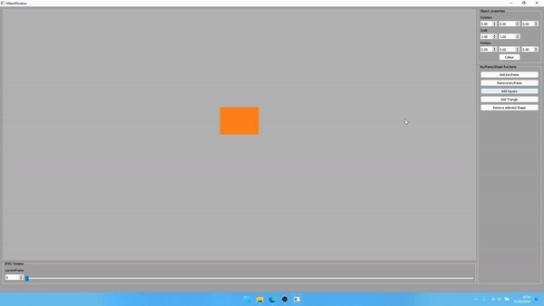

# David Owairu's CFGAA assignment 2022
## Basic 2d Vector Animation Software
For my computing for graphics assignment I wanted make a super basic version of a 2d Animation software like After Effects.The Bullet list below was my Initial goals and target for the project.I've marked off the things I was able to achieve to a resonable standard.

### Initial Features/Goals
- [x] 2D/3D Viewport 
- [ ] several basic 2D primitives.
  - only had 2 primitives 
- [x] scaling, rotating and transforming of primitives.
- [x] Ability to Animate these Objects and some parameters(scale,position etc)
  - Can Animate: Color,Scale,Rotation and translation 
- [x] Ui that works with all these elements
  - UI updates objects but objects dont affect UI

### Stretch Goals
- [ ] 2D manipulation of shapes vertices or points
- [ ] Having a layer system for Animating things on different(layers)
  - can hide layers of objects
  - can hide objects on a layer

# Initial Research
When starting the project I was still a little confused on how a lot of things in Opengl worked. I felt the most important thing for me to understand was how to draw objects on to the screen. My most useful resources for my early research period were https://learnopengl.com/ and The Chernos OpenGL tutorial series on Youtube.
After Getting comfortable the process of drawing an object, creating shaders and passing in uniforms. I started converting my raw openGL knowledge to the NGL graphics Library. Having access to all of the demos and examples through github made this really easy to do. Finally Once I had the basics down I started working on designing the classes that i would need for my program.

## Class Structure
My program has three main classes and one struct;
- Timeline
- layer
- Shape
- keyframe

### Timeline.h
Timeline is responsible for controlling everything to with animation for my program. It's main function is to set/remove keyframes from specific objects and play those keyframes when the user hits the spacebar. The most challenging part of creating this class was figuring out a proper way to increment the frames on the timeline and animate an object only when it needs to be animated.For a long while I had an issue where my program would start animating everything no matter what frames the keys were set on. I temporaryrily solved this issue then realised that it didnt funtion as I thought it would. I ended up reverting back to the previous method, because my "solution" would wait several frames to play the next set of keyframes instead of playing the immediately.

### Layer.h
The layer class is basically just a storage class for shapes. I was meant to use it as a second level of control for the visibility of shapes and animations.All Shapes are initialised to a baselayer and can be added from this layer or any user created ones. I initially stored the shapes within the timeclass as a vector of shapes but because I wanted the Timeline class to only control manipulation of shapes I moved that functionality else where. I ran into a lot of problems here and ended up commenting out a lot of my layering code when it came to implementing the UI.

### Shape.h
Shape is the main Drawing class, responsible for creating shapes and storing all their "keyable properties". It makes use of NGL transformations for storing its transform values, a modified version of RGBA with a convert function and Keyframes.h for creating Keyframes on an object.Every shape drawn with the shape class has a Vertex Array Object created as member variable and stored it as a Smart pointer to avoid any memory leaks.

### Keyframe.h
small struct that holds a frame number,colour value and transformation. I use this struct to create a keyframe list that can be accessed and modeified and  through the shape class when its time to draw.

## optimizations and Improvements
Here are some of the more important, interesting/challenging features that I would have implemented had I more time; 
- ##### Rendering Class
  - Right now rendering is managed by the shape class which is fine, but I think it would be easier to expand the program if i had a dedicaed render class that could    take in different types of objects and apply different "render option/settings" to them.  
- ##### object picking
   - Making use of an extra framebuffer to generate color ids for objects i could have implemented a picking system so that the user can select objects using their mouse as well as a list view of all the objects in the scene. 
- ##### live Drawing of shapes using bexier curves
  - The ability to use the position underneath that mouse to place and draw the vertices of an object would have been really intresting to implement. 
- ##### Actual Timeline widget
  - A custom created timeline widget rather than a slider. This could allow the user to visually see what keyframes they have on the timeline and where they are located. 
- ##### More interpolation options
  - I could have added multiple interpolation options between each of the frames, right now everything is done using linear interpolation.   
- ##### Saving and loading scenes
- ##### saving animation out to an image sequnce

Project demonstration

## conclusion
I'm not very proud of the final product, I definetly feel I could have done a lot more. I didnt start on time which cost me lot. Despite this, I learned a lot about OOP and the overall software development process.The project also served as a really good introduction to OpenGL and has opened my eyes to the power we hold as Technical Artists. making use of and learning git was also really  great. I created a few branches while working and it was really cool, I was able to test out solutions to problems without affecting my work which was amazing.   
